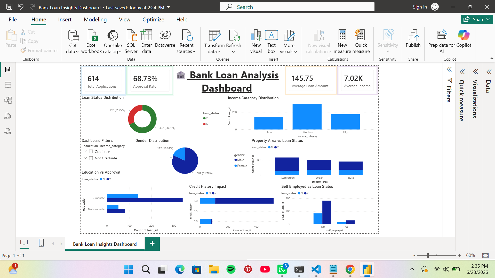

# 📊 Bank Loan Data Engineering & Analysis Project

**Author:** **Tanushree Ambade**

---

## 📌 Project Overview

This project demonstrates a complete **Data Engineering and Business Intelligence workflow** using a Bank Loan dataset. The project includes data extraction, transformation, loading into PostgreSQL, SQL analysis, and an interactive Power BI dashboard for business insights.

The objective is to analyze loan applications, approval trends, applicant income, loan amounts, and other important factors that influence loan approval decisions.

---

## 🏗️ Project Architecture

```
CSV Dataset
     │
     ▼
Extract (Python)
     │
     ▼
Transform (Cleaning + Feature Engineering)
     │
     ▼
Load into PostgreSQL
     │
     ▼
SQL Analysis
     │
     ▼
Power BI Dashboard
```

---

## 🛠️ Technologies Used

* Python
* Pandas
* SQLAlchemy
* PostgreSQL
* SQL
* Power BI
* DAX
* Git & GitHub

---

## 📂 Project Structure

```
Bank_Loan_Data_Engineering_Project
│
├── data/
│   ├── bank_loan_data.csv
│   └── bank_loan_cleaned.csv
│
├── scripts/
│   ├── extract.py
│   ├── transform.py
│   ├── load.py
│   └── etl.py
│
├── sql/
│   └── analysis_queries.sql
│
├── screenshots/
│   └── dashboard.png
│
├── Bank_Loan_Analysis_Dashboard.pbix
│
├── requirements.txt
│
└── README.md
```

---

## 🔄 ETL Process

### Extract

* Loaded Bank Loan dataset
* Performed initial data inspection
* Checked data types
* Identified missing values
* Generated summary statistics

### Transform

Performed data cleaning:

* Filled missing categorical values
* Filled missing numerical values
* Removed inconsistencies

Feature Engineering:

* Total Income
* Income Category
* Loan Category

Renamed all columns to **snake_case** for better database compatibility.

### Load

* Connected Python with PostgreSQL
* Loaded transformed dataset into PostgreSQL database
* Created table:

  * `bank_loan_data`

---

## 🗄️ SQL Analysis

Performed SQL queries to analyze:

* Total Loan Applications
* Loan Approval Rate
* Average Loan Amount
* Average Applicant Income
* Education vs Loan Approval
* Gender Distribution
* Property Area Analysis
* Credit History Analysis
* Income Category Distribution
* Loan Category Distribution
* Self Employed Analysis

---

## 📊 Power BI Dashboard

The dashboard provides interactive visualizations including:

### KPI Cards

* Total Applications
* Approval Rate
* Average Loan Amount
* Average Income

### Charts

* Loan Approval Status
* Gender Distribution
* Income Category
* Property Area
* Education vs Loan Approval
* Credit History vs Loan Status
* Self Employed vs Loan Status
* Loan Category

### Filters

* Gender
* Education
* Property Area
* Income Category
* Loan Category

---

## 📷 Dashboard Preview

The following dashboard was developed in Power BI to analyze bank loan applications, approvals, income categories, and customer demographics.



---

## 📈 Key Insights

* Total Loan Applications: **614**
* Loan Approval Rate: **68.73%**
* Average Loan Amount: **145.75**
* Average Total Income: **7024.71**
* Applicants with good credit history have a significantly higher approval rate.
* Semiurban regions show the highest number of approved loans.
* Graduate applicants receive more loan approvals compared to non-graduates.

---

## 🚀 Future Improvements

* Automate ETL pipeline using Apache Airflow
* Store data in a cloud database
* Deploy dashboard using Power BI Service
* Add predictive loan approval model using Machine Learning

---

⭐ If you found this project useful, consider giving it a star on GitHub!


